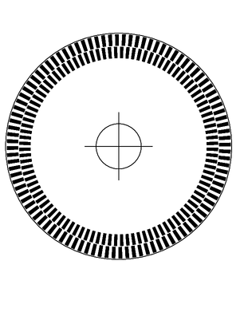
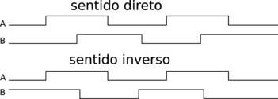

Generating Quadrature Encoding Disks
====================================

Python script to generate quadrature encoding disks in PostScript.

They have two rings of slots as below.

When rotating they generate two signals in quadrature.

Analysing these signals, one can detect the direction of rotation and the amount. Detecting all transitions (rising and falling) of these signal, on can quadruple the resolution ot a disk. A disk with 100 slots in each ring enables a 3600/400 resolution.

The parameters are:
       r : radius in mm
       c : center radius
       m : external margin
       s : slot height in mm
       d : distance between slot rings
       a : alternate format

It can generates two formats, because some printers/typesetters do not interpretate correctly some PostScript constructions.
